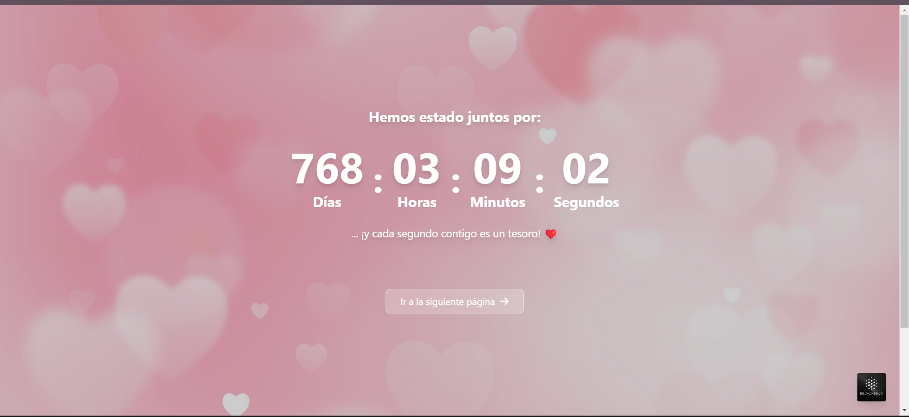

# 💖 Proyecto Romántico con React + Vite

Este es un proyecto especial construido con **React + Vite**, diseñado para crear una experiencia romántica y memorable. ❤️✨

## 🌟 Características  
✅ **Interfaz elegante y animada** con Framer Motion.  
✅ **Mensajes personalizados** con un diseño encantador.  
✅ **Navegación fluida** con React Router.  
✅ **Efectos visuales hermosos** con CSS y fondos dinámicos.  

## 🚀 Instalación  
Sigue estos pasos para ejecutar el proyecto en tu máquina:

1️⃣ **Clona este repositorio**  
```bash
git clone https://github.com/joseorteha/mi-proyecto-romantico.git
```

2️⃣ **Instala las dependencias**  
```bash
npm install
```

3️⃣ **Inicia el servidor de desarrollo**  
```bash
npm run dev
```

4️⃣ **Abre tu navegador** y ve a:  
   👉 [http://localhost:5173/](http://localhost:5173/)  

---

## 📸 Vista Previa   

  


---

## 🛠️ Tecnologías Usadas  
- **React** ⚛️ - Framework para UI  
- **Vite** ⚡ - Rápido y eficiente  
- **Framer Motion** 🎬 - Animaciones suaves  
- **Tailwind CSS** 🎨 - Estilos modernos y responsivos  
- **React Router** 🔀 - Navegación fluida  

---

## 💡 Personalización  
Si deseas modificar los mensajes románticos, ve al archivo:  
📌 **`/src/components/Message.jsx`**  

También puedes cambiar los estilos en:  
📌 **`/src/styles/message.css`**  

---

## 💖 Créditos  
👨‍💻 **Desarrollado por:** [José Ortega](https://github.com/joseorteha)  
📷 **Instagram:** [@mr.orteg4](https://www.instagram.com/mr.orteg4/)  
💼 **LinkedIn:** [José Ortega](https://www.linkedin.com/in/jos%C3%A9-ortega-497387321/)  

🚀 ¡Disfruta este proyecto y hazlo aún más especial!

